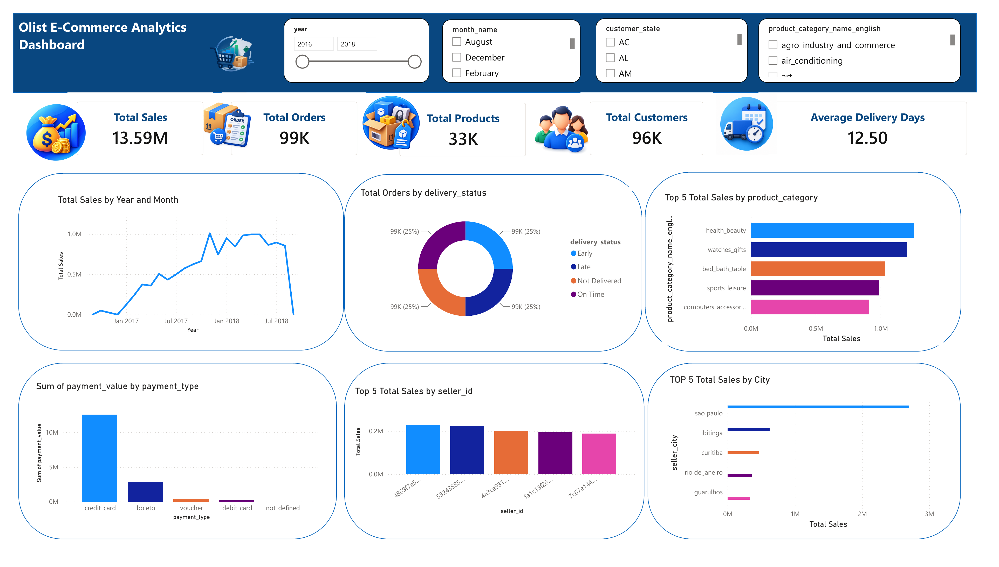

# Olist E-Commerce Data Warehouse & Analytics

> End-to-end Data Warehouse and Business Intelligence project built with SQL Server, ETL, and Power BI.

---

## 📌 Project Overview

This project builds an end-to-end analytics solution for the Olist Brazilian E-Commerce dataset.

The solution transforms raw CSV source data into a structured and business-ready Data Warehouse, followed by an interactive Power BI dashboard.

The complete data journey is:

```text
CSV Source
    ↓
Bronze Layer
    ↓
Silver Layer
    ↓
Gold Layer
    ↓
Power BI
```

---

## 🏗️ Data Warehouse Architecture

The Data Warehouse follows a layered architecture designed to separate raw ingestion, data transformation, and analytical consumption.

### Bronze Layer

The Bronze layer stores the raw source data with minimal transformation.

The main purpose of this layer is to:

- Preserve the original source structure
- Store incoming data
- Maintain load metadata
- Support historical traceability
- Provide a reliable source for downstream processing

### Silver Layer

The Silver layer transforms the raw data into clean and standardized data.

The main processes include:

- Data cleaning
- Data type conversion
- Standardization
- Data validation
- Deduplication
- Data quality classification
- Business rule application
- Data transformation

### Gold Layer

The Gold layer contains business-ready analytical data.

The data is organized using a **Star Schema** designed for reporting, analytics, and Power BI.

---

## ⭐ Gold Star Schema

### Dimension Tables

- `DimDate`
- `DimCustomer`
- `DimProduct`
- `DimSeller`

### Fact Tables

- `FactSales`
- `FactPayments`
- `FactDelivery`

### Fact Grain

#### FactSales

**One row = one product line within one order**

#### FactPayments

**One row = one payment record within one order**

#### FactDelivery

**One row = one order**

---

## ⚙️ ETL & Data Engineering

The ETL process was implemented using SQL Server Stored Procedures.

The pipeline includes:

- Incremental loading
- Watermark-based processing
- Batch control
- Execution logging
- Transaction handling
- Idempotent loading
- Data quality validation
- Deduplication
- Source-to-target validation

### ETL Metadata Tables

```text
etl.Pipeline_Control
etl.Run_Log
etl.Batch_Control
```

### ETL Flow

```text
Raw CSV
   ↓
Bronze Ingestion
   ↓
Silver Transformation
   ↓
Gold Dimensions
   ↓
Gold Facts
   ↓
Power BI
```

---

## 🔍 Data Quality Challenges

During the project, several real-world data quality issues were identified and handled.

### 1. ZIP Code Leading Zeros

Some ZIP codes contained leading zeros, for example:

```text
09560
```

Storing these values as integers would remove the leading zero.

Therefore, ZIP code fields were stored as text.

---

### 2. Seller State Standardization

Some source records contained additional text inside the state field, for example:

```text
rio de janeiro, brasil,RJ
```

The Silver layer standardized these values to the required state code.

---

### 3. Customer Identity Mapping

The source data contains both:

```text
customer_id
customer_unique_id
```

A single `customer_unique_id` can be associated with multiple source `customer_id` records.

Therefore:

- Silver customer grain is based on `customer_id`
- Gold `DimCustomer` uses `customer_unique_id` as the business identity

This allows the Gold layer to maintain one row per unique customer.

---

### 4. Delivery Timestamp Issues

During data validation, **189 orders** were identified with inconsistent timestamp sequences.

Examples included delivery timestamps occurring before earlier order events.

Instead of deleting these records, they were retained and flagged using data quality status and reason fields.

This preserves the original records while making data quality issues visible and traceable.

---

### 5. Missing Product Categories

Some products did not have a product category in the source data.

These records were retained in the Silver layer and classified as data-quality records rather than being silently removed.

---

### 6. Order Reviews Parsing

The review file contained parsing challenges because review comments could contain commas and line breaks.

The review data was excluded from the current analytical scope because review text was not required for the defined business analysis.

---

## 🔄 Incremental & Idempotent Loading

The ETL design supports controlled and repeatable data loading.

### Watermark

A watermark is used to identify the latest successfully processed source load.

### Batch Control

Each load can be associated with a unique source batch key.

### Idempotency

The ETL process is designed so that rerunning a load does not create duplicate records.

### Execution Logging

Each ETL execution records information such as:

- Pipeline name
- Start time
- End time
- Status
- Rows extracted
- Rows loaded
- Rows rejected
- Error message

---

## ✅ Data Warehouse Validation

The final Data Warehouse was validated using multiple checks.

### Row Count Validation

```text
FactSales       = 112,650
FactPayments    = 103,886
FactDelivery    = 99,441
```

### Control Total Validation

Source and target financial totals were compared to verify that measures were preserved during ETL processing.

### Foreign Key Integrity

Fact-to-Dimension relationships were validated to ensure that all required dimension keys existed.

### Fact Grain Validation

The grain of each fact table was validated to ensure that duplicate fact records were not introduced.

### Dimension Uniqueness

Business keys in the Gold dimensions were checked for uniqueness.

### Data Quality Validation

Silver layer data quality classifications were reviewed to ensure that rejected and checked records were traceable.

---

## 📊 Final Data Warehouse Volumes

| Object | Rows |
|---|---:|
| DimDate | 1,096 |
| DimCustomer | 96,096 |
| DimProduct | 32,951 |
| DimSeller | 3,095 |
| FactSales | 112,650 |
| FactPayments | 103,886 |
| FactDelivery | 99,441 |

---

## 📈 Power BI Dashboard

The final Power BI dashboard provides an interactive view of the e-commerce business.

### Key KPIs

| KPI | Value |
|---|---:|
| Total Sales | 13.59M |
| Total Orders | 99K |
| Total Products | 33K |
| Total Customers | 96K |
| Average Delivery Days | 12.50 |

### Dashboard Analysis

The dashboard includes:

- Sales trend by year and month
- Order distribution by delivery status
- Top 5 product categories by sales
- Payment value by payment type
- Top 5 sellers by sales
- Top 5 cities by sales
- Customer state analysis
- Delivery performance analysis

### Dashboard Filters

The report includes interactive filters for:

- Year
- Month
- Customer State
- Product Category

---

## 🖥️ Dashboard Preview



[View the Power BI Dashboard PDF](./e-commerce%20dashboard.pdf)
---

## 📁 Repository Structure

```text
olist-ecommerce-data-warehouse-analytics/
│
├── SQL/
│   ├── 01_Database_and_Schemas.sql
│   ├── 02_Bronze_Layer.sql
│   ├── 03_Silver_Layer.sql
│   ├── 04_Gold_Layer.sql
│   ├── 05_ETL_Stored_Procedures.sql
│   └── 06_Validation_Queries.sql
│
├── e-commerce dashboard.pdf
│
└── README.md
```

---

## 🛠️ Technologies

- SQL Server
- T-SQL
- Data Warehousing
- ETL
- Star Schema
- Power BI
- DAX

---

## 🎯 Project Objectives

The main objectives of this project were:

1. Build a layered Data Warehouse architecture.
2. Transform raw e-commerce source data into clean analytical data.
3. Implement ETL processes using SQL Server Stored Procedures.
4. Apply data quality and validation techniques.
5. Design a Star Schema for analytical reporting.
6. Connect the Data Warehouse to Power BI.
7. Build an interactive business analytics dashboard.

---

## 📚 Key Skills Demonstrated

### SQL & Data Engineering

- T-SQL
- Joins
- CTEs
- Window Functions
- Aggregations
- Data Cleaning
- Data Validation
- Stored Procedures
- Transactions
- ETL
- Incremental Loading
- Idempotent Processing
- Data Warehousing
- Star Schema
- Data Quality

### Power BI

- Data Modeling
- Star Schema Relationships
- DAX Measures
- KPI Cards
- Interactive Slicers
- Trend Analysis
- Category Analysis
- Payment Analysis
- Delivery Analysis
- Business Reporting

---

## 🚧 Project Challenges & Engineering Decisions

This project was built with a focus on realistic data engineering scenarios rather than only producing a final dashboard.

Key engineering decisions included:

- Keeping Bronze data raw and traceable
- Separating data cleaning into Silver
- Building a business-ready Gold layer
- Using surrogate keys in Gold dimensions
- Preserving source business keys
- Defining explicit fact table grain
- Implementing data quality status and reason fields
- Using ETL logging and batch control
- Preventing duplicate loads through idempotent processing
- Validating source-to-target consistency before analytics consumption

---

## 👤 Author

**Mohamed Elshehawy**

Data Analyst | SQL | Power BI | Python

---

## 📬 Project Repository

GitHub Repository:

[Olist E-Commerce Data Warehouse & Analytics](https://github.com/mohamedelshehawy-DATA/olist-ecommerce-data-warehouse-analytics)
